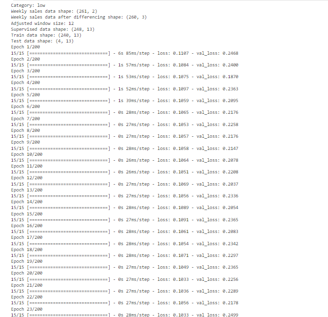
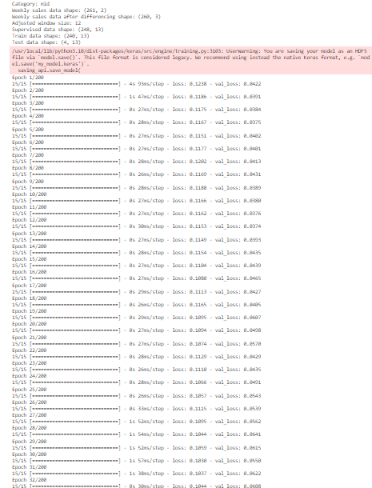
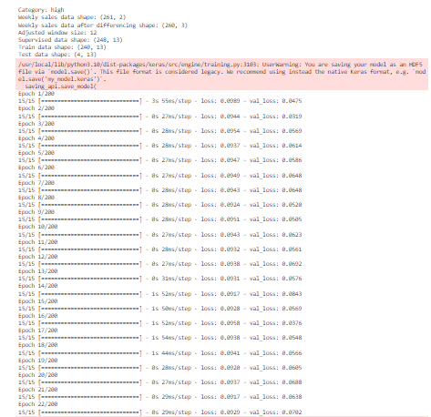
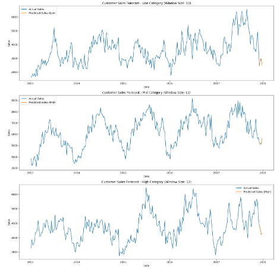

# Machine Learning

## Overview

The Machine Learning part of this application is a sales prediction system. We create a model for an sales system to predicting the sales next one week based on one month dataset before. The prediction system will be divided by three category such as low-end category, mid-end category and high-end category. After that, based on what the user has read, the model will show how much sales prediction in next week.

## Datasets

The dataset we use comes from [Kaggle][data-kaggle] (raw dataset) and process it to the data [above][link-id].

## Model Accuracy & Loss

Model Accuracy & Loss

  

Visualization

  

## How to replicate our projects

### 01 Data Preprocessing

To run this model you need to follow these steps:

- Download the datasets [here][link-id]
- Upload the dataset in your notebook environment
- Install the required libraries
- Pre-process the data

### 02 Modelling

- Insert the [dataset][link-id] in to the model [here][model]
- Build and compile the model with the architectures as mentioned [above](#model-architecture)
- Do a model evaluation
- Convert the model to `.h5` format

[link-id]: https://github.com/C4AnN/Laptop_Lens/blob/main/ML/Dataset/Data_Barang_Keluar.csv
[model]: https://github.com/C4AnN/Laptop_Lens/blob/main/ML/Model_LaptopLens_Final.ipynb
[data-kaggle]: https://www.kaggle.com/datasets/artakusuma/laptopecomercee
